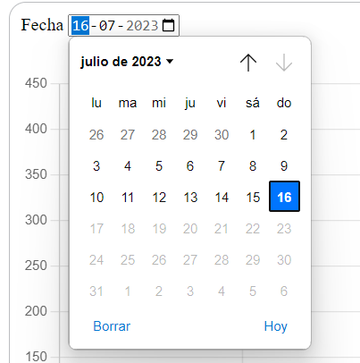
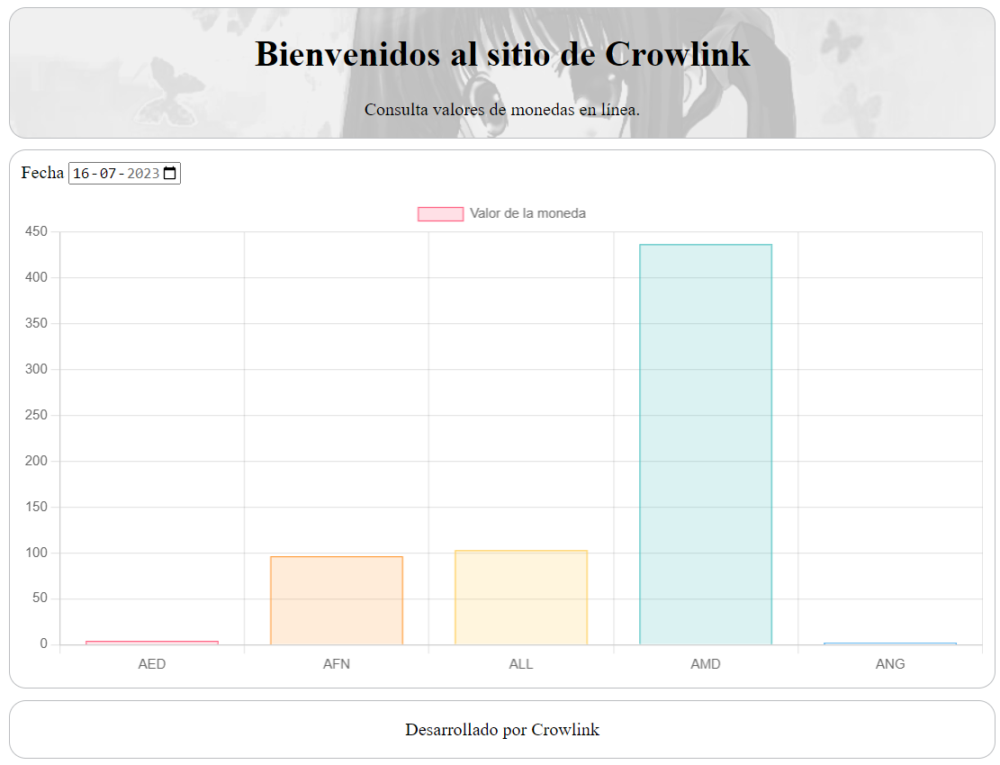

# PROYECTO 3: Tablero de Datos ("Dashboard")

## **ÍNDICE**

* [1. Importante](#1-importante)
* [2. Intro](#1-intro)
* [3. Instalación](#2-instalacion)
* [4. Forma de uso](#3-Formadeuso)

****

## 1. Importante

IMPORTANTE: El sitio fue desplegado en esta ruta: https://sprightly-faloodeh-d3a6d1.netlify.app/ pero el servicio que use era http y Netlify corre en https, por lo tanto, la llamada al servicio da error. 
Localmente funciona bien, pero no desde Netlify.

## 2. Intro

El proyecto actual consiste en un sitio que llama a una servicio publico que consulta los valores de monedas y los muestra en un gráfico. Se pueden consultar por fecha.

## 3. Instalacion

Para instalar, primero necesitas un servidor local. Para ello, se debe ejecutar el siguiente comando

```
npm install -g live-server
```

Una vez instalado, para ejecutar localmente, se debe ejecutar el siguiente comando

```
npm start
```

## 4. Forma de uso

Cuando el proyecto inicializa, por defecto se cargan los valores de las monedas del día actual.



Si desea consultar otra fecha, pinche en el input "fecha" y seleccione la fecha que desea. Al hacerlo, el gráfico se recargará automáticamente.


